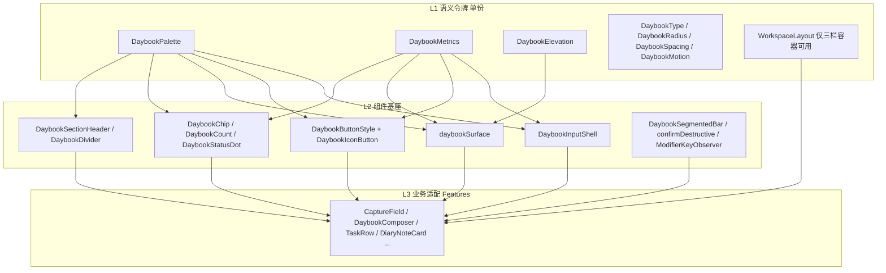

# AreaChain 设计系统收敛（新对话交接提示词）

## 使用方法（给用户，每个阶段重复一遍）

每个阶段配两份提示词文件，放在本目录：`design-system-P<n>-execute.md`（执行）和 `design-system-P<n>-verify.md`（独立验收）。

1. 新开对话 A，输入：`@.cursor/plans/design-system-P0-execute.md 按这个文件逐步执行，做完按它的汇报格式汇报。`
2. A 汇报后**不要相信它说的"通过"**。新开对话 B，输入：`@.cursor/plans/design-system-P0-verify.md 按这个文件逐项验收，只读，给结论和整改清单。`
3. B 结论"通过" → 回到架构师对话，说"P0 验收通过，出 P1"，我再生成 `P1-execute` / `P1-verify`（后续阶段的行号依赖上一阶段结果，不能提前生成）。
4. B 结论"不通过" → 新开对话 C，输入：`@.cursor/plans/design-system-P0-execute.md 这是原任务；下面是验收发现的问题，只修这些问题，修完重跑该文件的"最终验证"：<粘贴 B 的整改清单>`。修完再跑一次 B。
5. 执行者和验收者必须是**两个不同的新对话**，不要让同一个对话既做又验。

> 本文件是给新对话的完整任务书。新对话上下文有限（256k）：现状数字、文件路径、行号、命名、基准来源、阶段顺序、验证命令全部在此钉死。**不要重扫仓库、不要重新命名、不要重新设计、不要自行选基准。**

## 0. 给新对话的执行规则

1. 你在 AreaChain 仓库（原生 macOS：SwiftUI + AppKit + SwiftData）。先读 `AGENTS.md`，再读本文件，然后**只读当前阶段的"必读文件"**。
2. 每次对话只做**一个阶段**（第 7 节）；阶段太大可跨两次对话，但旧 API 必须在阶段结束时删除，**不保留转发层、不保留旧名字**。开始时把阶段标为进行中；结束时更新第 8 节。
3. 令牌名、组件名、文件名、variant 名、基准来源是**已决定项**。需要新增令牌或 variant 时只能在上限内增加，并登记到第 8 节。
4. **提问义务**：遇到第 5 节基准决策表和兜底规则都判不了的视觉/尺寸取舍，必须停下来用提问工具问用户，复述其答案确认，直到用户说"对"，再把答案写进第 8 节决策记录。不得自己挑。
5. 不安装、不启动、不发布、不碰签名、不改 `AreaChain/Domain` 的业务规则、不读取真实用户数据。
6. 硬约束：单文件 ≤ 500 行、单函数 ≤ 50 行；新增可见文案同时补 `en` / `zh-Hans`（`AreaChain/Resources/Localizable.xcstrings`）；不把旧测试结果当新改动的证据。
7. 迁移只换"外观实现"，**不改行为**：Return / ⌘Return / Shift+Return / Esc 分级 / 空文本 ↓ / 输入法组合文本 / 撤销 / 焦点 / 选中 / 草稿 / 快捷键注册条件 / 所有 `SyntaxViewAnchor("...")` 与 `accessibilityIdentifier` 字符串。

## 1. 目标与非目标

目标
- 建两层基座：**L1 语义令牌**（颜色、尺寸、字号、圆角、间距、阴影、动效）和 **L2 组件基座**（输入壳、按钮、表面、芯片、分节头、分隔线、分段栏、确认框、修饰键监听）。
- `AreaChain/Features` 只能组合 L2 组件和引用 L1 令牌。**哪怕只用一次的视觉元素也必须先成为基座的 variant**，页面内不得直接画 `RoundedRectangle` / `Capsule` / `Circle` 作视觉、不得写 `.shadow` / `.font(.system(size:` / 系统色 / `.opacity(字面)` / 字面圆角 / `.buttonStyle(.plain)`。
- **菜单栏与工作台使用同一套令牌和同一种视觉**（用户决定）。工作台只保留"有侧栏、有页头、内容更宽"的布局差异，放在 `WorkspaceLayout`。

非目标
- 不改 `DaybookTextField` / `DaybookTextEditor` 的 Coordinator（有测试保护）；不改 `SyntaxOverlay` / `SyntaxAutocompleteView` 的定位与事件监听逻辑。
- 不改产品约定：任务捕获 Return 建待办、⌘Return 记手记；手记浮层输入严格单行；搜索不创建标签；剪贴板捕获与普通输入解析差异。
- 不引入第三方 UI 库；不建 `class` 继承；不新建第二套主题目录。

## 2. "基类 + 重载"在 Swift/SwiftUI 的对应做法（必须遵守）

SwiftUI View 是 struct，**没有类继承**。对应关系：
- 令牌 = `enum` 命名空间下的 `static let`（单份，因为两宿主已统一）；`Color.daybook(name:...)` 必须具名（匿名动态色在 SwiftUI Button 拷贝时 SIGSEGV），并用 `static let` 缓存。
- 组件 = 单一 `struct` View 或 `ViewModifier` + `variant` 枚举 + `@ViewBuilder` slot + `configure: (inout Configuration) -> Void` 闭包。
- **重载规则（用户确认）**：调用点只能通过 `configure` 闭包改"尺寸类"（高度、宽度、内边距、行数），颜色 / 字体 / 阴影 / 圆角必须引用令牌名；同一重载出现在两个及以上调用点，就升级为基座的一个具名 variant。例：任务行默认 `metrics.rowHeight` 36，手记行 `configure { $0.minHeight = 46 }`。
- 按钮 = 实现 `ButtonStyle` 协议。
- 业务包装（`CaptureField`、`DaybookComposer`、`TaskRow` 等）= 薄适配器，只传配置、绑定、回调。
- **两类分支的处理规则（P1 起生效）**：旧代码里的 `isWorkspace` 分支分两类。**视觉分支**（颜色 / 字体 / 圆角 / 阴影 / 内边距不同）→ 取标准侧、换令牌，删掉工作台侧。**能力分支**（工作台有侧栏页头、无底栏，所以页内要显示筛选条；独立窗口需要最小尺寸；宽行可放两行；备注气泡只在菜单栏）→ 改用布尔环境值 `@Environment(\.workspaceEmbedded)`（定义在 `WorkspaceLayout.swift`，`MainSplitWorkspaceView` 注入 `true`）。`embedded` **只能出现在"显示什么 / 布局多大"的判断里**，禁止用它切换颜色、字体、圆角、阴影；P7 lint 检查 `embedded` 与 `DaybookPalette|DaybookTheme|DaybookType|opacity|Color.` 不得同行。

## 3. 现状盘点（2026-09-22 已统计，勿重扫）

### 3.1 现有令牌层（`AreaChain/Theme`）
- `DaybookTheme.swift`：`DaybookSwatch` 原始值；`DaybookTheme` 8 基色（ink / muted / rule / stamp / paper / done / destructive / checkmark）+ 表面色（surface / cardSurface / cardSurfaceHover / hoverFill / pressFill / cardBorder / cardBorderHover / cardSelectionFill / cardSelectionStroke / focusRing）+ `DaybookTheme.Syntax`（标签绿、时间蓝、p1–p4）+ `DaybookRadius`（xs 4 / small 6 / medium 10 / card 12 / large 16 / full）+ `DaybookSpacing`（2/4/8/12/16/24，page 16）+ `DaybookType`（title 16 / subtitle 12 / body 13 / caption 11 / badge 10 / label 10 / entity 17 / section 11）+ `DaybookShadow` + `SectionStamp` / `RowIconButton` / `ComposerAddButton`。
- `DaybookWorkspaceStyle.swift`：`DaybookViewStyle`（enum，`.standard` / `.workspace`，6 派生属性 + `inputBorderWidth`）、`WorkspaceSwatch` / `WorkspaceStyle`（工作台色与尺寸）、`DaybookPageHeader`、`DaybookInputKind`、`DaybookInputChrome`（109–159 行）、`WorkspaceFilterLabel`、`WorkspaceSidebarHeaderAction`、`WorkspaceSidebarRow`。注入点：`Features/Workspace/MainSplitWorkspaceView.swift:41`；测试注入 6 处：`WorkspaceStyleTests.swift:74,100`、`QuadrantLayoutTests.swift:113`、`GanttInteractionTests.swift:216`、`WorkspaceRenderingTests.swift:266`、`CaptureOverlayLayoutTests.swift:144,309`。
- `DaybookChrome.swift`：`DaybookMotion`（snappy / interactive / smooth / strike / checkmark / strikethrough / collapse）、`DaybookHaptics`、`DaybookQuietButtonStyle`、`DaybookEmptyState`、`DaybookNavButton`、`DaybookPeriodBar`、`DaybookField`、`daybookCardStyle`。
- `ModernComponents.swift`：`ModernCheckbox`（控件，保留）、`PillBadge`、`modernCard` / `ModernCardModifier`、`modernRow` / `ModernRowModifier`、`DaybookGroupedCard`、`ModernTaskTitle`（保留）。

### 3.2 字面值失控数字（`AreaChain/` 下）
- 字面字号 245 处（Features 184）；取值：8 (11) / 8.5 (20) / 9 (33) / 9.5 (19) / 10 (37) / 10.5 (10) / 11 (56) / 11.5 (12) / 12 (11) / 13 (9) / 14 (3) / 16 (3) / 6–7.5 (12，图标) / 18、26、36 各 1。
- 字面圆角 77 处：2 (2) / 2.5 (7) / 3 (3) / 3.5 (12) / 4 (9) / 4.5 (5) / 5 (7) / 6 (15) / 7 (2) / 8 (13) / 10 (2)。
- `DaybookTheme.x.opacity(字面)` 153 处；系统色直用 70 处（`Color.orange`：`MenuBarPopoverView.swift:347`、`TaskRow+Badges.swift:71,85`、`SyntaxHelpCard.swift:119,255`；`Color.green`：`DiaryCardComponents.swift:182,186,207`；`Color.red`：`DiaryCardComponents.swift:23,26`、`BoardCommandStrip.swift:40,46,155,163`；`Color.white`：`DiaryQuickComposerView.swift:262`、`TaskDetailScheduleSection.swift:148`；`Color.black.opacity` 阴影与点击感知层）。
- `.shadow(color:` 16 处、12 种组合；字面动画 21 处（Features：`DiaryQuickComposerView.swift:154,155`、`DiaryNoteCard.swift:143`、`BoardCommandStrip.swift:27`、`FooterBar.swift:362`、`MenuBarControls.swift:36`）。
- `isWorkspace ?` 三元 52 处：Theme 31；Features 21（`Diary/DiaryStandaloneView.swift:17`；`Tasks/TaskRow+Badges.swift:16,71,73,74,95,97,98`；`Workspace/TaskDetailDrawer.swift:220,222,223,233`；`Tasks/TaskRow.swift:154,374`；`Calendar/CalendarPage.swift:45`；`Tasks/DaybookProgressRing.swift:14,33`；`Diary/DiaryCardComponents.swift:13`；`Diary/DiaryNoteCard.swift:116,117,120`）。
- `.buttonStyle(.plain)` 96 处：Workspace 24 / Diary 21 / Tasks 19 / Theme 14 / MenuBar 13 / Search 3 / Quadrant 1 / Board 1。

### 3.3 输入壳（4 套 + 5 处自绘）
- `Theme/BoardCaptureRow.swift`：消费者 `MenuBar/CaptureField.swift`、`Diary/DiaryQuickComposerView.swift`（compact，`locksHeight: true` 34pt）、`Theme/DaybookPage.swift` 的 `DaybookComposer`（`paintsChrome: false`）。
- `daybookInputChrome(focused:kind:)`（`DaybookWorkspaceStyle.swift:109–159`）：消费者 `DaybookComposer`（DaybookPage.swift:210）、`DaybookField`（DaybookChrome.swift:223）、`Diary/DiaryCardComponents.swift:96`、`Diary/DiaryPage.swift:244,330`、`Diary/DiaryQuickComposerView.swift:41,179`。
- `DiaryQuickComposerView.workspaceComposer` else 分支（43–51）自绘。
- 自绘：`MenuBar/MenuBarSearchField.swift:110`、`Workspace/WorkspaceHeaderBar.swift:112–116`（`WorkspaceHeaderSearchCapsule`）、`Workspace/TaskDetailNotesView.swift:58`、`Workspace/TaskDetailSubtasksView.swift:122`、`Diary/DiaryWindowView.swift:78`。
- **不动**：`DaybookTextField.swift`、`DaybookTextEditor.swift`、`SyntaxTextField.swift`、`SyntaxTextEditor.swift`、`SyntaxOverlay.swift`、`SyntaxAutocompleteView.swift`、`SyntaxViewAnchor.swift`。

### 3.4 按钮
- 专用 struct 11：`DaybookQuietButtonStyle`、`DaybookNavButton`、`CommandReturnButton`、`CaptureAttributesButton`、`RowIconButton`、`ComposerAddButton`、`BoardCommandStripButton`（Board/BoardCommandStrip.swift:53）、`DiaryTagToggleButtons` / `DiaryDayMoveButtons`（Diary/DiaryOrganizeMenus.swift）、`BoardFilterDropdownButton`（Tasks/BoardFilterBar.swift:176）、`WorkspaceSidebarHeaderAction`。
- 纯图标 `.plain` 按钮 45 处、点击区 9 种（无 / 9 / 12 / 18 / 20 / 22 / 24 / 26 / 28）：`Diary/DiaryCardComponents.swift:201,210,224,238,254,267`、`Workspace/TaskDetailSections.swift:232,242,286`、`Workspace/TaskDetailSubtasksView.swift:183,249,257`、`Tasks/BoardFilterBar.swift:230,242,275,286`、`MenuBar/MenuBarSearchField.swift:42,65,101`、`MenuBar/FooterBar.swift:269,282`、`Diary/DiaryPage.swift:221,240`、`Search/SearchPage.swift:24,44`、`Workspace/WorkspaceHeaderBar.swift:95,151`、`Board/BoardCommandStrip.swift:73`、`Tasks/TaskRow+Menus.swift:42`、`Diary/DiarySummaryRow.swift:338`、`Diary/DiaryQuickComposerView.swift:101`、`Workspace/ResidentsPage.swift:112`、`Workspace/TaskDetailScheduleSection.swift:90`、`Workspace/WorkspaceFilteredListView.swift:68`、`Workspace/TaskDetailClassificationSection.swift:86`、`Tasks/TasksPage+Header.swift:126`、`Tasks/BatchActionBar.swift:195`、`Diary/DiaryWindowView.swift:97`；Theme：`CommandReturnButton.swift:36`、`LiveComposerPreviewHeader.swift:177`、`SyntaxHelpCard.swift:87`、`DaybookWorkspaceStyle.swift:232`、`LiveDiaryComposerPreview.swift:206`、`CaptureAttributesView.swift:99`。
- 自绘 `Menu` label 7 处：`TaskRow+Menus.swift:51`、`DiarySummaryRow.swift:345`、`DiaryNoteCard.swift:217`、`LiveDiaryComposerPreview.swift:212`、`BoardCommandStrip.swift:108`、`FooterBar.swift:291`、`TaskDetailClassificationSection.swift:20`。

### 3.5 表面（卡 / 行 / 分组 / 浮层）
- 共享修饰符消费者：`modernCard` 5、`modernRow` 2（`TaskRow`、`DiarySummaryRow`）、`daybookCardStyle` 1（`TrashPage`）、`DaybookGroupedCard` 2（`DayBoardSections`、`WorkspaceFilteredListView`）、`BoardRowChrome` 3（**指针/选中行为组件，保留**）。
- 自绘 fill+stroke 24 处：`Calendar/CalendarMonthGrid.swift:94`、`Diary/DiaryNoteCard.swift:25,116`、`Diary/DiaryQuickComposerView.swift:46`、`Diary/DiaryWindowView.swift:78`、`Gantt/GanttPage.swift:166`、`MenuBar/FooterBar.swift:223,353`、`MenuBar/MenuBarFilterFlyout.swift:185,240,361`、`MenuBar/MenuBarSearchField.swift:110`、`Search/BoardSearchHitRow.swift:90`、`Tasks/BatchActionBar.swift:201`、`Tasks/DayBoardSections.swift:54`、`Tasks/TaskRow+Badges.swift:22`、`Tasks/TaskRowSubtaskMiniViews.swift:29`、`Tasks/TasksPage+Sections.swift:31,58`、`Workspace/TaskDetailDrawer.swift:232`、`Workspace/TaskDetailNotesView.swift:58`、`Workspace/TaskDetailQuadrantGrid.swift:55`、`Workspace/TaskDetailSubtasksView.swift:122`、`Workspace/WorkspaceGlobalSearchView.swift:124`。
- 浮层面板 11 处：`MenuBarFilterFlyout.swift:187,242`、`BatchActionBar.swift:207`、`SyntaxHelpCard.swift:44`、`SyntaxAutocompleteView.swift:203`、`CaptureAttributesView.swift:126`、`LiveComposerPreviewHeader.swift:186,306`、`LiveDiaryComposerPreview.swift:92`、`DaybookRowBubbles.swift:86,194`。
- 行高：`TaskRow.swift:154` 标准 36；`DiarySummaryRow.swift:124` 46。

### 3.6 芯片 / 计数 / 状态点 / 颜色映射
- `Capsule()` 48 处（Features 31 / Theme 17），共享的只有 `PillBadge`（2 消费者）、`workspaceFilterChrome`（1）、`CaptureAttributesButton`。自绘：`TasksPage+Header.swift:131`、`TasksPage+Sections.swift:86,105,332,340`、`BoardFilterBar.swift:247,369`、`DiaryPage.swift:312`、`DiaryNoteCard.swift:205,237`、`DiaryQuickComposerView.swift:228`、`DiaryCardComponents.swift:26,147,186`、`MenuBarSearchField.swift:70`、`FooterBar.swift:216`、`BoardSearchHitRow.swift:78`、`TaskDetailSubtasksView.swift:230`；Theme：`LiveComposerPreviewHeader.swift:121,134,147,163,270`、`SyntaxHelpCard.swift:200,279`。
- 状态小圆点 6 处：`MenuBarSearchField.swift:52`、`MenuBarPopoverView.swift:347,363`、`MenuBarFilterFlyout.swift:136,331`、`GanttPage.swift:156`。计数文本 14 处、5 种字体写法。
- `DiaryTagChrome.color(for:)` 定义在 `Features/Diary/DiaryNoteCard.swift:6`（密码红 / 小巧思橙 / 日记蓝 / 默认 stamp），被 MenuBar / Tasks / Board 共 5 文件消费；`TaskDetailClassificationSection` 标签写死 `.systemIndigo`。
- 优先级色旁路：`Theme/QuadrantMiniMark.swift:3–19`、`Board/BoardFilterChoices.swift:229`。

### 3.7 分节头 / 分隔线 / 空态 / 分段栏 / 确认框 / 事件监听
- 自绘分节标题 18 处：`TaskDetailDrawer.swift:220,222,223`（uppercase + tracking）、`TaskDetailScheduleSection.swift:16,76,131,216`、`TaskDetailHeaderSection.swift:121`、`TaskDetailQuadrantGrid.swift:15`、`TaskDetailClassificationSection.swift:17,74`、`TaskDetailNotesView.swift:35`、`TaskDetailSubtasksView.swift:48`、`TaskDetailSections.swift:222`、`CalendarMonthGrid.swift:70`、`QuadrantPage.swift:64`、`CalendarPage.swift:61`、`TasksPage+Sections.swift:71`。
- 改色 `Divider` 7 处：`GanttPage.swift:56`、`WorkspaceHeaderBar.swift:26`、`MenuBarFilterFlyout.swift:163,216`、`MenuBarPopoverView.swift:137`、`CalendarPage.swift:104`、`BoardFilterBar.swift:301`。
- 空态：`DaybookEmptyState` 11 消费者（良好）；自绘 `TaskDetailDrawer.swift:54`、`DiaryPage.swift:407`。
- 分段栏：`DaybookQuietTabBar` 在 `Features/MenuBar/MenuBarControls.swift:12`；`TaskDetailWeekdayPicker`（`TaskDetailScheduleSection.swift:135`）自绘。
- 确认框：`TrashConfirm.swift` 10 消费者；裸 `.confirmationDialog` 5（`SettingsView.swift:47`、`DiaryWindowView.swift:34`、`DiaryPage.swift:177`、`TrashPage.swift:54`、`DiaryNoteCard.swift:162`）、`.alert` 2（`SettingsView.swift:35`、`DiaryNoteCard.swift:138`）。
- `.flagsChanged` 监听重复：`Board/BoardRowChrome.swift:86`、`Theme/CommandReturnButton.swift:53`；`.keyDown` 与 `SyntaxOverlay` 监听专用，不动。

## 4. 目标结构

## 5. 基准决策（用户已确认，2026-09-22）

### 5.1 总原则
- **视觉与尺寸基准 = 菜单栏浮层任务页现状**（`MenuBarPopoverView` + `CaptureField` + `TasksPage` + `TaskRow` 在 `.standard` 下的样子）。工作台改成同一套；只保留布局差异。
- **兜底规则**：未在下表单独列出的视觉/尺寸差异，一律取菜单栏任务页现值；菜单栏没有的元素（检查器抽屉、日历格、甘特色块、设置页）取其当前实现但换成令牌。规则也判不了的，按第 0 节第 4 条问用户。
- **冲突判定顺序**：本节决策表 > 兜底规则 > 已有测试断言的值 > 问用户。

### 5.2 决策表（结构来源 / 尺寸 / 视觉）
- 输入壳：结构取 `DaybookInputChrome` 的 `kind` 枚举 + `BoardCaptureRow` 的三段 slot。高度**全局 34**（含工作台）。视觉取 `CaptureField`：未聚焦底 `ink 3%` + 边 `rule 40%` 0.6pt；聚焦底 `surface` + 边 `ink 35%` 0.9pt；**不用蓝色聚焦环**；composer 高 34 / 圆角 8 / 内边距 h10 v7；search 取菜单栏底栏搜索框现值：高 28 / 圆角 6 / 内边距 h7 v4（P0 曾误抄工作台值 10 与 8/10，P2 纠正）；editor 圆角 6 / 内边距 4 / 不锁高。
- 按钮：结构取 `DaybookQuietButtonStyle` 的 hover / press / reduceMotion / disabled 机制。悬停视觉 = **淡灰圆角底**（`FooterActionItemModifier` 做法，`fill.hover`），不用蓝环。点击区 regular 28 / compact 22 / inline 18。
- 表面：结构取 `ModernRowModifier` / `ModernCardModifier` 的状态驱动。列表容器 = **纸底 + 分隔线，无白卡**（工作台去掉 `DaybookGroupedCard`）。行默认高 36，hover `fill.hover`，选中 `fill.selection` + `border.selection`。卡片（日历格、象限格、抽屉分组）圆角 10、边 `border.subtle`、无阴影。
- 浮层面板：结构取 `SyntaxAutocompletePopup`（纸底、圆角 8、边 `rule 70%` 0.7pt）。阴影统一 **黑 14% / 模糊 8 / 下偏 2**。
- 芯片：结构取 `PillBadge`。填充 `tint 12%`、描边 `tint 35%` 0.8pt、高 18。
- 分节头：结构取 `SectionStamp`（icon + title + count）。**一律不大写**、`DaybookType.section` 11 semibold + 0.5 字距；抽屉字段标题为 `.field` 层级，只有尺寸差异。
- 分隔线：`rule` 三档 `subtle 25% / regular 40% / strong 65%`。
- 分段栏：结构取 `DaybookQuietTabBar`，滑块阴影 = `elevation.raised`（黑 8% / 1.5 / 0.5）。
- 布局：工作台页头 50、内容最大宽 880、侧栏行 28 与内边距、页边距 16 **保留**在 `WorkspaceLayout`，只允许 `MainSplitWorkspaceView.swift`、`WorkspaceSidebarView.swift`、`WorkspaceHeaderBar.swift`、`DaybookPage.swift`、`WorkspaceLayout.swift` 引用。

## 6. 基座规格（命名已定；每文件 ≤ 300 行）

### 6.1 L1 令牌（全部单份 `enum` + `static let`）
- `Theme/DaybookPalette.swift`：`text`（primary=ink, secondary=muted, tertiary=muted 75%, disabled=muted 45%, done, onAccent=白）；`fill`（page=paper, surface, subtle=ink 3%, hover, press, selection=stamp 8%, scrim=黑 0.1%）；`border`（default=rule, subtle=黑 6%, strong=ink 35%, **focus=ink 35%**, selection=stamp 35%, faint=rule 40%〔P2 新增，输入壳未聚焦边〕）；`status`（pending=systemOrange, success=systemGreen, danger=destructive）；`accent`=stamp、`accentFill` 12%、`accentBorder` 35%；`diaryPreset(.password/.idea/.journal/.default)`（搬 `DiaryTagChrome`）、`tagDefault`（替换 `.systemIndigo`）；`syntax`（原 `DaybookTheme.Syntax` 原值搬入）。颜色字段上限 34。原 `DaybookSwatch` 搬入本文件。
- `Theme/DaybookMetrics.swift`：`inputHeight` 34、`controlHeight` 28、`rowHeight` 36、`chipHeight` 18；`hit.regular` 28 / `.compact` 22 / `.inline` 18；`radius.inputComposer` 8 / `.inputSearch` 6〔P2 由 10 纠正〕 / `.inputEditor` 6 / `.control` 6 / `.panel` 8 / `.card` 10 / `.inline` 4；`inputInsets(kind:)`（composer h10 v7 / search h7 v4〔P2 由 h10 v8 纠正〕 / editor 4）；`stroke.hairline` 0.5 / `.regular` 0.6 / `.focus` 0.9 / `.emphasis` 1.0。
- `Theme/DaybookElevation.swift`：`.none` / `.raised`（黑 8% / 1.5 / 0.5）/ `.floating`（黑 14% / 8 / 2）；修饰符 `.daybookElevation(_:)`。
- `Theme/WorkspaceLayout.swift`：`headerHeight` 50、`maxContentWidth` 880、`sidebarRowHeight` 28、`sidebarRowVerticalPadding` 4.5、`sidebarRowHorizontalPadding` 8、`sidebarTopInset` 28；同文件收留 `DaybookPageHeader`、`WorkspaceSidebarRow`、`WorkspaceSidebarHeaderAction`，以及能力分支用的环境键 `workspaceEmbedded: Bool`（默认 false）。
- `Theme/DaybookTokens.swift`：从 `DaybookTheme.swift` 搬出 `DaybookRadius`（补 `xxs` 2.5、`regular` 8）、`DaybookSpacing`、`DaybookType`（补 `kbd` 8.5 semibold monospaced、`micro` 9 medium、`bodyLarge` 14、`display` 26 light；总数上限 12）。字号映射：8–8.5→kbd；9–9.5→micro；10–10.5→badge/label；11–11.5→caption；12–12.5→subtitle；13–13.5→body；14→bodyLarge；16→title；≥18→display；6–7.5 图标改 `DaybookType.micro`。圆角映射：2–3→xxs；3.5–4.5→xs；5–6→small；7–8→regular；10→medium。允许 ≤ 0.5pt 漂移。
- `DaybookMotion` 补 `fade`（easeInOut 0.15）。

### 6.2 L2 组件基座（`AreaChain/Theme`）
- `DaybookInputShell.swift`：`DaybookInputShell<Leading, Field, Trailing>(kind: DaybookInputKind, focused: Bool, configure: ((inout DaybookInputShellConfiguration) -> Void)? = nil, leading:, field:, trailing:)` + 两个便捷 init（只 field / leading+field）；`DaybookInputShellConfiguration` 顶层 struct，含 `height`（composer 34 / search 28 / editor nil）、`minHeight`、`insets`、`spacing`（8 / 4 / 0）、`radius`，`static func standard(for:)` 从 metrics 取值；壳内颜色固定为 `fill.subtle→surface`、`border.faint→focus`、描边 `Stroke.regular→focus`；内置 `.daybookHideInputChrome()`。`DaybookInputKind` 搬到本文件。
- `DaybookButtonStyle.swift`：`DaybookButtonStyle(_ variant, size:, isFocused:)`，variant 九种：文字类 `.quiet / .subtle / .prominent / .destructive / .active / .pill(tint:)`（只加内边距），图标类 `.icon / .iconActive / .iconDestructive`（固定正方形点击区）；size `.regular 28 / .compact 22 / .inline 18`；悬停 = `fill.hover` 淡灰底，无蓝环；`isFocused` 画键盘焦点环。`DaybookIconButton(systemName:label:size:role:isActive:enabled:action:)` 薄包装。`Menu` 标签用 `.daybookMenuLabel(size:isActive:isFocused:)` 修饰符。`CommandReturnButton`、`CaptureAttributesButton` 保留为专用组件（有 anchor 与测试），内部改用本样式（P3b）。非按钮语义控件保留 `.plain` 并在同一行加 `// control: <原因>`。
- `DaybookSurface.swift`：`daybookSurface(_ variant: .row | .card | .panel | .banner | .cell, isHovered:, isSelected:, isFocused:, configure:)`；`.panel` 自带 `elevation.floating`。`BoardRowChrome` 内部视觉改走 `.row`。
- `DaybookChip.swift`：`DaybookChip(variant: .tag | .count | .filter | .status | .token | .action, isSelected:, tint:, onRemove:, action:) { label }`；同文件 `DaybookStatusDot(color:)`、`DaybookCount(_:emphasis:)`（字体 `DaybookType.badge.monospacedDigit()`）。优先级色一律 `DaybookPalette.syntax.priorityColor / priorityFill`。
- `DaybookSectionHeader.swift`：`DaybookSectionHeader(_ title, level: .page | .section | .field | .column, icon:, count:, trailing:)`；同文件 `DaybookDivider(emphasis: .subtle | .regular | .strong)`。
- `DaybookSegmentedBar.swift`：`DaybookSegmentedBar<Item: Hashable>(items:, selection:, label:)`（原 `DaybookQuietTabBar` 泛型化）。
- `TrashConfirm.swift` 增 `confirmDestructive(isPresented:title:message:confirmTitle:action:)`。
- `ModifierKeyObserver.swift`：单一 `.flagsChanged` 监听，`@Observable var isCommandPressed`。
- 保留不改结构：`DaybookEmptyState`、`ModernCheckbox`、`ModernTaskTitle`、`DaybookPeriodBar`、`DaybookScroller`、`DaybookMotion`、`DaybookHaptics`。

## 7. 阶段（每阶段结束旧 API 必须删净）

### P0 令牌落地
必读：`Theme/DaybookTheme.swift`、`Theme/DaybookWorkspaceStyle.swift`、`Theme/DaybookChrome.swift`（1–60）、`Theme/ModernComponents.swift`（165–221）、`Features/Diary/DiaryNoteCard.swift`（1–15）、`Features/MenuBar/CaptureField.swift`、`Features/MenuBar/FooterBar.swift`（340–370）、`AreaChainTests/Theme/DaybookContrastTests.swift`、`AreaChainTests/Theme/WorkspaceStyleTests.swift`。
做：按 6.1 新建 `DaybookTokens.swift`（搬出 `DaybookRadius / DaybookSpacing / DaybookType` 并补令牌）、`DaybookPalette.swift`（搬入 `DaybookSwatch` 与 `DaybookTheme.Syntax`→`DaybookPalette.Syntax`，更新 6 个文件引用）、`DaybookMetrics.swift`、`DaybookElevation.swift`（5 处 `DaybookShadow` 引用改 `DaybookElevation.raised.color` 后删除 `DaybookShadow`）、`WorkspaceLayout.swift`（6 个布局常量 + 搬入 `DaybookPageHeader` / `WorkspaceSidebarHeaderAction` / `WorkspaceSidebarRow`；`WorkspaceStyle` 中这 6 个常量删除，其 5 处消费者改 `WorkspaceLayout.*`）；`DaybookMotion` 补 `fade`。**`WorkspaceStyle` / `WorkspaceSwatch` / `DaybookViewStyle` 其余部分暂留到 P1 一起删**；`DaybookTheme` 基色暂留（P6 删）。
测试：新建 `AreaChainTests/Theme/DaybookTokenTests.swift`（metrics 数值、elevation 三档互异、radius/type 新令牌、`inputInsets`、`diaryPreset` 映射）；`SyntaxHighlighterTests.swift:52` 改 `DaybookPalette.Syntax.tagNS`；`WorkspaceStyleTests.swift:84` 改 `WorkspaceLayout.headerHeight`；其余测试不动。
完成标准：`./scripts/build.sh test --only-testing AreaChainTests/DaybookTokenTests --only-testing AreaChainTests/DaybookContrastTests --only-testing AreaChainTests/WorkspaceStyleTests --only-testing AreaChainTests/SyntaxHighlighterTests` 通过；`rg 'DaybookShadow|DaybookTheme\.Syntax' AreaChain AreaChainTests` 为空；`rg 'enum (DaybookRadius|DaybookSpacing|DaybookType|DaybookSwatch)' AreaChain/Theme/DaybookTheme.swift` 为空；`python3 -B scripts/check_workflow.py` 通过；`git diff --stat` 中 Features 只允许 `Tasks/TaskRow+Badges.swift`、`Workspace/WorkspaceHeaderBar.swift`、`Workspace/WorkspaceSidebarView.swift`。

### P1 删除双宿主分支
提示词：`design-system-P1-execute.md` / `design-system-P1-verify.md`（每处替换已标 A 视觉 / B 能力）。
做：在 `WorkspaceLayout.swift` 新增 `workspaceEmbedded` 环境键；视觉分支取标准侧并换令牌（`WorkspaceStyle.*` 映射表见执行提示词），能力分支改 `embedded`；`DaybookGroupedCard` 改为无白卡容器；`ModernRowModifier` 去掉工作台 padding；抽屉分节标题去掉 `.textCase(.uppercase)`；`RowBubblePlacement.calculate` 参数 `isWorkspace:` 改名 `wideHost:`；`DaybookInputKind` 与去分支后的 `DaybookInputChrome` 搬到 `DaybookChrome.swift`（P2 删）；`WorkspaceFilterLabel` / `workspaceFilterChrome` / `BoardFilterDropdownButton.workspaceCapsule` 因零消费者直接删除；删除 `DaybookViewStyle`、环境键、`WorkspaceSwatch`、`WorkspaceStyle`、`DaybookWorkspaceStyle.swift`、`MainSplitWorkspaceView.swift:41` 注入（改 `.environment(\.workspaceEmbedded, true)`）、5 处测试注入同法替换。`WorkspaceStyleTests.swift` 删除，新建 `WorkspaceLayoutTests.swift`（原生字段字重、页头嵌入时 50 高且标题原点稳定、非嵌入时无最小高度）。
文档：`AGENTS.md:38` 改为指向 palette / metrics / tokens 与 `WorkspaceLayout`、`workspaceEmbedded` 规则；`AGENTS.md:57`、`.agents/skills/areachain-verify/references/checks.md:33` 的 `WorkspaceStyleTests` 改为 `DaybookTokenTests`、`WorkspaceLayoutTests`；`.agents/skills/areachain-ui/SKILL.md:25` 表格行改指向新文件；`docs/architecture.md:71,75,77` 同步。
完成标准：`rg 'daybookViewStyle|DaybookViewStyle|isWorkspace|WorkspaceStyle\b|WorkspaceSwatch|WorkspaceFilterLabel|workspaceFilterChrome|workspaceCapsule' AreaChain AreaChainTests` 为空；`rg 'embedded.*(DaybookPalette|DaybookTheme|DaybookType|\.opacity\(|Color\.)' AreaChain` 为空；文档无悬空引用；`./scripts/build.sh test` 定向跑 `WorkspaceLayoutTests` / `DaybookTokenTests` / `DaybookContrastTests` / `WorkspaceRenderingTests` / `MenuBarPopoverRenderingTests` / `CaptureOverlayLayoutTests` / `QuadrantLayoutTests` / `GanttInteractionTests` / `DiarySummaryRowTests` / `TaskRowInteractionTests` / `BoardFilterBarTests` 通过；`check_workflow.py` 通过。

### P2 输入壳
提示词：`design-system-P2-execute.md` / `design-system-P2-verify.md`。
做：palette 加 `border.faint`；metrics 纠正 `inputSearch` 6、search 内边距 h7 v4 并同步 `DaybookTokenTests`；新建 `DaybookInputShell.swift`（`DaybookInputKind` 搬入）；迁 13 处消费者：`CaptureField`、`DaybookComposer`、`DiaryQuickComposerView`（compact + editor）、`DiaryPage`（searchChrome；锁定草稿提示框改为带 `// token-exempt` 的令牌自绘，P4 迁 banner）、`DiaryCardComponents` 编辑器、`SearchPage`、`MenuBarSearchField`、`WorkspaceHeaderSearchCapsule`（胶囊改壳，保留 260 宽）、`TaskDetailSubtasksView.addSubtaskInput`、`TaskDetailNotesView.notesEditorBox`、`DiaryWindowView` 编辑器；删除 `BoardCaptureRow.swift`、`DaybookInputChrome` / `daybookInputChrome`、`DaybookField`。新建 `DaybookInputShellTests`（标准配置取值、三种 kind 原生高度、configure 重载）。
文档：`AGENTS.md:40` 输入组件句加 `DaybookInputShell`；`docs/architecture.md:71,111`、`docs/usage.md:57`、`docs/features.md:24` 修正属性按钮描述并写明共用外壳。
完成标准：`rg 'BoardCaptureRow|DaybookInputChrome|daybookInputChrome|DaybookField\b|locksHeight|showsFocusShadow|paintsChrome' AreaChain AreaChainTests` 为空；输入框不得自绘 `focusRing`（`rg 'focusRing' AreaChain/Features` 只允许 `FooterBar.swift` 的 `FooterActionItemModifier` 按钮描边，该描边留给 P3 删除）；`DaybookInputShell(` ≥ 12 处；`DiaryPage` 锁定草稿提示框保持现有 `token-exempt` 自绘，不要再包进壳（P4 再迁 banner）；行为层 6 个文件 `git diff` 为空；定向测试（`DaybookInputShellTests` / `DaybookTokenTests` / `WorkspaceLayoutTests` / `DaybookTextFieldTests` / `DaybookTextFieldSearchTests` / `CaptureOverlayLayoutTests` / `InputSyntaxInteractionTests` / `DiaryComposerInteractionTests` / `WorkspaceRenderingTests` / `MenuBarPopoverRenderingTests` / `MenuBarToolbarStateTests` / `DiaryWindowLifecycleTests` / `PrivacyRenderingTests`）通过；`check_workflow.py` 通过。P2 通过后用户自行打开菜单栏与工作台各看一次输入框。

### P3a 按钮基座 + MenuBar / Tasks / Board / Search
提示词：`design-system-P3a-execute.md` / `design-system-P3a-verify.md`。
做：新建 `DaybookButtonStyle.swift`（样式 + `DaybookIconButton` + `daybookMenuLabel`）；跨模块一行改名后删除 `DaybookQuietButtonStyle`、`RowIconButton`、`DaybookNavButton`、`ComposerAddButton`、`WorkspaceSidebarHeaderAction`、`FooterActionItemModifier`；`BoardCommandStripButton` / `BoardCommandStripMenu` 改用样式，`BoardCommandStripIcon` 退化为纯图标；四个模块现有 33 处 `.plain` 中 22 处迁为样式，11 处控件加 `// control:`（清单见验收提示词 B2）。新建 `DaybookButtonStyleTests`。
完成标准：`rg 'DaybookQuietButtonStyle|RowIconButton|DaybookNavButton|ComposerAddButton|WorkspaceSidebarHeaderAction|FooterActionItemModifier|isButtonHovered' AreaChain AreaChainTests` 为空；四模块无裸 `.plain`；control 注释恰好 11 条；定向测试通过。

### P3b 按钮 Diary / Workspace / Theme / Quadrant
提示词：`design-system-P3b-execute.md` / `design-system-P3b-verify.md`。
做：不新增 variant。Diary 21、Workspace 24、Theme 13、Quadrant 1 处 `.plain`：图标与文字动作迁到 `DaybookButtonStyle` / `DaybookIconButton` / `daybookMenuLabel`；胶囊、复选框、整行、固定 58×22 属性按钮、语法行悬停替换共 17 处加 `// control:`（清单见验收 B2）。`CommandReturnButton` 去掉自绘底，改用 `.icon` / `.iconActive`（⌘ 按下为 active）。`.bordered` / `.borderedProminent` 不动。已复制的绿色改成 `.iconActive` / `.active`（绿色留给 P6 的 `status.success`）。
完成标准：代码里的裸 `.buttonStyle(.plain)` 为零（同行 `// control:` 或 `///` 文档注释不算）；`// control:` 共 28 条（P3a 的 11 + 本阶段 17）；`.pill(tint:` 的调用 tint 来自 `DaybookPalette`（枚举声明 `case pill(tint: Color)` 不算）；`syntax.diary.popout`、`syntax.commandReturn.button`、`syntax.attributes.button`、`syntax.attributes.close`、`syntax.candidate.` 仍在；定向测试通过。

### P4a 表面基座
提示词：`design-system-P4a-execute.md` / `design-system-P4a-verify.md`。
做：新建 `daybookSurface(_:isHovered:isSelected:configure:)`，variant 为 `.row` / `.card` / `.panel` / `.banner`。行 = 现 `modernRow`（悬停只改底、选中才描边、无阴影）；卡片 = 现 `modernCard` 去掉阴影，默认圆角 10，调用点原圆角 6 用 `configure` 保留；`.panel` 纸底 + `daybookElevation(.floating)`，本阶段只建不迁；`.banner` 接锁定草稿提示框。`DaybookGroupedCard` 已是无白卡的 `VStack`，6 处换成同样的 `VStack` 后删除。删除 `modernCard` / `modernRow` / `daybookCardStyle` 及三个 Modifier。`modernFocusRing`、象限格自绘色、浮层 `.shadow`、搜索行/附件行/语法范例卡留给 P4b。
完成标准：上述旧 API 零引用；Features 里 `.shadow(color:` 数量与 P4a 前相同（本阶段不碰阴影）；定向测试通过。

### P4b 浮层与剩余自绘表面
提示词：`design-system-P4b-execute.md` / `design-system-P4b-verify.md`。
做：12 处 `.shadow(color:` 全部换成 `daybookElevation`（分段栏滑块 `.raised`，其余浮层 `.floating`）。搜索工作台行、附件结果行、语法范例卡、抽屉分组、手记卡片改用已有 `daybookSurface`；手记置顶且未高亮时另留一条印章描边。象限选择格、日历日格、甘特色块保留自绘（今日环 / 投放 / 优先级色是表面基座没有的第三态），只改注释。不新增 variant，不改 `DaybookSurface.swift` 的外观规则。
完成标准：代码里的 `.shadow(color:` 只剩 `DaybookElevation.swift` 改写后的说明或为零；上述行与卡片已用 `daybookSurface`；定向测试通过。

### P5a 芯片
提示词：`design-system-P5a-execute.md` / `design-system-P5a-verify.md`。
做：新建 `DaybookChip`（选中：色 14% 底 + 35% 描边；未选中：空底 + 细边；悬停淡灰底）。`PillBadge` 的 `color` 改名为 `tint` 后删除。注释里写了「P5 迁 DaybookChip」的胶囊改为这个芯片。星期圆点不是胶囊，只改注释，不改成芯片。预览条、属性按钮 58×22、语法色胶囊留给后面的清扫，本阶段不碰。
完成标准：`PillBadge` 与「P5 迁 DaybookChip」为零；`DaybookChip` 已接上日期、提醒、标签、筛选、计数和 token；定向测试通过。

### P5b 分节头、分隔线、分段栏、确认框、监听器
做：`DaybookSectionHeader`、`DaybookDivider`、`DaybookSegmentedBar`、`confirmDestructive`、`ModifierKeyObserver`。提示词在 P5a 验收通过后生成。

### P6 颜色、字号、圆角、动效清扫（按模块：MenuBar → Tasks → Diary → Workspace → 其余页面 → Theme）
做：`DaybookTheme.x` / `DaybookTheme.x.opacity(字面)` → `DaybookPalette.*`；系统色 → `palette.status.* / text.onAccent / fill.scrim`；`.font(.system(size:` → `DaybookType.*`；字面圆角 → `DaybookRadius.*` 或 `metrics.radius.*`；字面动画 → `DaybookMotion.*`。双语补齐：`Domain/SyntaxAutocomplete.swift` 候选副标题（「标签」「重要且紧急…」「早上…」）改为返回本地化 key，由 `SyntaxAutocompletePopup` 用 `LocalizedStringKey` 显示；`SyntaxAutocompletePopup.footerGuide`「切换 / 补全 / 关闭」改 key；`Localizable.xcstrings` 同时补 en / zh-Hans。Theme 模块完成后删除 `DaybookTheme` enum（`DaybookTheme.swift` 文件删除）。
完成标准（每模块）：模块目录下 `rg '\.font\(\.system\(size:|cornerRadius:\s*[0-9]|DaybookTheme\.|Color\.(orange|red|green|white|black|blue|gray)\b|\.(spring|easeInOut|easeOut|easeIn|linear)\((response|duration)' <模块目录>` 为空；`WorkspaceRenderingTests` + `MenuBarPopoverRenderingTests` + `SyntaxAutocompleteTests` 通过。Theme 完成后 `rg 'DaybookTheme' AreaChain AreaChainTests` 为空。

### P7 禁令、文档、全量回归
做：
- `scripts/check_workflow.py` 新增 `check_theme_tokens(root)`：扫描 `AreaChain/Features/**/*.swift`，用现有 `swift_code()` 屏蔽注释与字符串后匹配：`RoundedRectangle\(`、`Capsule\(`、`Circle\(\)`、`\.shadow\(`、`\.font\(\.system\(`、`cornerRadius:\s*[0-9]`、`Color\.(orange|red|green|white|black|blue|gray|primary|secondary)\b`、`\.opacity\([0-9.]+\)`、`\.buttonStyle\(\.plain\)`、`DaybookTheme\.`、`isWorkspace`、`WorkspaceLayout\.`（白名单外文件）、`embedded.*(DaybookPalette|DaybookTheme|DaybookType|\.opacity\(|Color\.)`（能力分支不得切视觉）。同行含 `// control:` 或 `// token-exempt: 原因` 则跳过。结果名 `theme-tokens`，加入 `run_checks`；`LIMITATIONS` 补"只匹配字面模式，不证明视觉一致"。`scripts/tests` 加单测（正例、负例、注释内不误报、exempt 与白名单生效）。
- 文档：`docs/architecture.md` Theme 段改为"令牌 / 基座 / 业务"三层并列出基座清单与基准决策；`docs/engineering.md` 加 `theme-tokens`；`AGENTS.md` "复用 DaybookTheme.swift 中的主题、字号、间距等定义"改为指向 `DaybookPalette / DaybookMetrics / DaybookTokens` 与基座。
完成标准：`python3 -B scripts/check_workflow.py` 零违规；`python3 -B -m unittest discover -s scripts/tests -v` 通过；`./scripts/build.sh test` 全量通过。

## 8. 状态与记录

- [x] P0 令牌落地
- [x] P1 删除双宿主分支
- [x] P2 输入壳
- [x] P3a 按钮（MenuBar + Tasks + Board + Search）
- [x] P3b 按钮（Diary + Workspace + Theme）
- [x] P4a 表面基座
- [x] P4b 浮层与剩余自绘表面
- [ ] P5a 芯片 / 计数 / 圆点
- [ ] P5b 分节头 / 分隔线 / 分段栏 / 确认框 / 监听器
- [ ] P6 MenuBar
- [ ] P6 Tasks
- [ ] P6 Diary
- [ ] P6 Workspace
- [ ] P6 Search / Calendar / Quadrant / Gantt / Trash / Attachments / Settings
- [ ] P6 Theme（含双语补齐、删 DaybookTheme）
- [ ] P7 禁令、文档、全量回归

决策记录
- 2026-09-22 用户确认：粒度 = 哪怕只用一次的视觉元素也必须经基座；重载 = configure 闭包只改尺寸、同一重载 ≥ 2 处升级 variant；旧组件一步到位删除，不留转发；双语补齐纳入。
- 2026-09-22 用户确认基准：视觉与尺寸全部以菜单栏浮层任务页为准，单份令牌；输入框聚焦 = ink 35% 灰描边、无蓝环、全局 34 高；按钮悬停 = 淡灰圆角底；列表 = 纸底 + 分隔线、工作台去白卡；浮层阴影 = 黑 14% / 8 / 2；分节头一律不大写；工作台仅保留 `WorkspaceLayout` 布局尺寸；结构基准按 5.2 表。
- 已知文档与实现差异：`docs/usage.md:57` 描述的菜单栏属性按钮实际只在工作台。`AGENTS.md` 中工作台尺寸与材质那一句已在 P1 改写为 `workspaceEmbedded` 只表达能力差异。
- 2026-09-22 P0 完成：新建语义色、尺寸、阴影和工作台布局令牌，并把 Swatch、Syntax、圆角、间距、字号从 DaybookTheme 迁出。
- 2026-09-22 P0 验收：通过
- 2026-09-22 P1 完成：视觉分支统一到菜单栏侧，能力分支改用 workspaceEmbedded，并删除 DaybookWorkspaceStyle。
- 2026-09-22 P1 记录：`WorkspaceRenderingTests` 在 `release` 窗口时触发 `NSWindowSectionController unregisterSeparator` 断言并挂起；改代码前的基线同样挂起。旧机制扫描还剩测试函数名 `diaryComposerKeepsNewlinesAndSavesOnceWithWorkspaceStyle`。
- 2026-09-22 P1 验收：不通过（A1 测试名仍含 WorkspaceStyle；F 定向测试在 WorkspaceRenderingTests 释放窗口时断言挂起，中断后 EXIT=241）
- 2026-09-22 P1 验收（复验）：通过。A–G 重跑成立；此前的测试名与窗口释放挂起已消失。定向测试 EXIT=0，11 个套件失败 0、跳过 0。未做人工窗口走查。`DaybookGroupedCard` 注释仍写白色分组卡，实现已不再绘制，不阻塞。
- 2026-09-22 P2 完成：新建 DaybookInputShell 并迁入 12 处输入框，锁定草稿提示框改为令牌自绘；搜索圆角 10→6、内边距 8/10→4/7，新增 border.faint；删除 BoardCaptureRow 与 DaybookInputChrome。
- 2026-09-22 P2 验收：通过。A–H 重跑成立；定向测试 EXIT=0，13 个套件 87 通过、失败 0、跳过 0。未做人工窗口走查。
- 2026-09-22 P3a 完成：新建 DaybookButtonStyle / DaybookIconButton / daybookMenuLabel，迁 MenuBar/Tasks/Board/Search 按钮并删除旧 API。
- 2026-09-22 P3a 验收：不通过（D 定向测试 EXIT=65；`MenuBarPopoverRenderingTests.diaryUsesOnlyFooterSearchAndFilters` 的 zh-Hans / light 在二次点击 (28, 27) 后 `isFiltering` 仍为 true）
- 2026-09-22 P3a 整改：FooterBar 悬停展开改走 `showFiltersFromHover` / `pointerLeftToolbar`，筛选触发区固定 compact 高度矩形点击，测试改为 `menubar.filter.open` 取中心点。
- 2026-09-22 P3a 验收：通过（A–E 重跑成立；定向测试 EXIT=0，11 个套件 77 通过、失败 0、跳过 0。未做人工窗口走查。）
- 2026-09-22 P3b 完成：Diary / Workspace / Theme / Quadrant 按钮迁入 DaybookButtonStyle，17 处非按钮控件加 control 注释，已复制态不再用绿色。
- 2026-09-22 P3b 验收：不通过（D 定向测试 EXIT=65；MenuBarPopoverRenderingTests.diaryFooterFilteringAndSearchingPreserveDraft 在 selectFilter 后 isFiltering 仍为 true）
- 2026-09-22 P3b 整改：筛选抽屉全窗点击层让开底栏 44pt，二次点击打到 `menubar.filter.open` 才能关闭；实测 CommandReturnButton 在 (336,404) 22×22，与底栏筛选 (12,16) 不重叠。未改测试、未改 DaybookButtonStyle 文档注释。
- 2026-09-23 P3b 验收：不通过（C2：`MenuBarPopoverView+Drawer.swift` 相对 HEAD 有未暂存 diff；A1 非空，仅 `DaybookButtonStyle.swift:67` 文档注释；B 的 `sidebar.trailing` 计数为 0，`pill(tint:` 过滤命中枚举声明。D EXIT=0，失败 0、跳过 0）
- 2026-09-23 P3b 验收：不通过（A1 仍只有 `DaybookButtonStyle.swift:67` 文档注释；B 的 `sidebar.trailing` 仍为 0，调用按执行稿换行，`pill(tint:` 仍命中 `case pill(tint: Color)`。A2=28，A3 的 17+11 条注释齐全，C1–C6 零越界，D EXIT=0，9 套件 67 通过、失败 0、跳过 0。E 通过。未做人工窗口走查。）
- 2026-09-23 P3b 整改：文档注释去掉 `.buttonStyle(.plain)` 字面量；`pill` 声明行注明 tint 取 `DaybookPalette.accent`；检查器按钮的 `systemName: "sidebar.trailing"` 收到 `DaybookIconButton(` 同一行。基座 `DaybookButtonStyle.swift` 因此相对 HEAD 有 diff。定向测试 EXIT=0。未宣布通过。
- 2026-09-23 P3b 验收：不通过（C3：`DaybookButtonStyle.swift` 相对 HEAD 有未暂存 diff，2 行注释。A1 空、plain 总数 28、A2=28、A3 的 17+11 齐全，B 抽查符合且 `pill(tint:` 过滤空，C1=4、C2/C4/C5/C6 零越界，D EXIT=0，67 通过、失败 0、跳过 0。E 通过。未做人工窗口走查。）
- 2026-09-23 P3b 整改：`DaybookButtonStyle.swift` 两处注释回到 HEAD，该文件工作区与暂存区 diff 为空。最终验证 1 再次命中第 67 行文档注释里的 `.buttonStyle(.plain)`；`pill(tint:` 过滤再次命中 `case pill(tint: Color)`。未再改基座去消掉这两条。定向测试 EXIT=0，结果包 `Test-AreaChain-2026.09.23_00-58-48-+0800.xcresult`：Passed，67 通过、失败 0、跳过 0。未宣布通过。
- 2026-09-23 P3b 验收：不通过（A1 非空，仅 `DaybookButtonStyle.swift:67` 文档注释；B 的 `pill(tint:` 过滤命中 `case pill(tint: Color)`。`sidebar.trailing` 计数为 1。A2=28，A3 的 17+11 齐全，C1–C6 零越界，D EXIT=0，结果包 `Test-AreaChain-2026.09.23_01-03-40-+0800.xcresult`：Passed，67 通过、失败 0、跳过 0。E 通过。未做人工窗口走查。）
- 2026-09-23 用户确认：上述两条是验收命令误伤，不改 `DaybookButtonStyle.swift`。A1 再排除 `///` 文档注释；`pill` 只匹配 `.pill(tint:` 调用。执行稿最终验证 1 与 P3b 完成标准同步收窄。
- 2026-09-23 P3b 验收：通过。收窄后的 A1 与 `.pill(tint:` 过滤零输出。其余沿用同日 01:03 定向测试（Swift 未再改）：EXIT=0，67 通过、失败 0、跳过 0，结果包 `Test-AreaChain-2026.09.23_01-03-40-+0800.xcresult`。未做人工窗口走查。下一阶段 P4。
- 2026-09-23 P4a 完成：新建 daybookSurface（row / card / panel / banner），行与卡片迁入并去掉卡片阴影，锁定草稿改用 banner，分组容器改为 VStack 后删除旧表面 API。
- 2026-09-23 P4a 验收：通过。A–E 重跑成立。A3 描边命令计数为 2，第二处是卡片未选中线宽 `: 0.8`。B1 命令合计 18，其中调用 11、函数定义 1、执行稿要求的预览注释 1、HEAD 里既有的 control 注释 5。B7 命令合计 7，分组替换 6 处，另一处是 `DayBoardSections.swift` 里原有的 `completedSection` 外层 `VStack`。定向测试 EXIT=0，结果包 `Test-AreaChain-2026.09.23_07-51-20-+0800.xcresult`：Passed，49 个用例、67 次运行，失败 0、跳过 0。未做人工窗口走查。
- 2026-09-23 P4b 完成：12 处手写阴影改为 daybookElevation（分段滑块 raised，其余 floating），五处表面改用 daybookSurface，象限格、日历日格和甘特色块保留自绘。
- 2026-09-23 P4b 验收：不通过（D 定向测试 EXIT=65；MenuBarPopoverRenderingTests.nativeToolbarReplacementPreservesSearchAndRendersBothAppearances 点击筛选后 isFiltering 仍为 false）
- 2026-09-23 P4b 验收：通过。A–E 重跑成立。floating=11，MenuBarControls 的 raised=1，BatchActionBar 仍为 ultraThickMaterial。日历注释 3、甘特注释 2，DaybookSurface.swift 零 diff。定向测试 EXIT=0，结果包 `Test-AreaChain-2026.09.23_08-56-46-+0800.xcresult`：Passed，8 套件，失败 0、跳过 0。未做人工窗口走查。

每阶段追加：日期、改动文件、运行的命令与结果、未覆盖项、新增令牌/variant 登记、向用户提问及其确认答案。全部完成后删除本文件；`.cursor/plans/areachain.md` 与 `quality-fixes.md` 已完成，可一并删除。
